# SajiloBihe Event Venue Booking - Frontend 🚀

Welcome to the **SajiloBihe Event Venue Booking - Frontend**. This web application allows users to browse and book event venues effortlessly while providing an **admin dashboard** for venue, booking, user, and contact management. Built with **React & Tailwind CSS**, the platform is fully responsive for **mobile and tablet devices**.

---

## 🌟 Features

### 🏛️ **For Users**

- **🏠 Home Page** – Browse available venues with images and details.
- **🔍 Venue Search & Filtering** – Search and filter venues based on price, location, and availability.
- **📖 View Stories** – Explore customer stories and event experiences.
- **📅 Book Venues** – Select a venue, choose a date, and book with ease.
- **👤 User Profile** – Update profile details including name, email, and phone number.
- **🔒 Change Password** – Securely update the user password.
- **🆘 Forgot Password** – Reset password via email authentication.
- **📩 Contact Enquiry** – Submit inquiries through the contact form.
- **🚫 Unauthorized Access Handling** – If a user tries to access the admin dashboard, they are redirected to an "Unauthorized Access" page.
- **🔑 Login & Register** – Secure authentication system with JWT.

### 🛠️ **For Admin**

- **📊 Admin Dashboard** – Interactive dashboard with **visual analytics** on venue bookings and users.
- **🏛️ Venue Management** – Add, update, and delete event venues.
- **📦 Order Management** – View, approve, or cancel user bookings.
- **👥 User Management** – Manage user roles, delete users if necessary.
- **📖 Story Management** – Add and manage customer event stories.
- **📩 Contact Request Management** – View and respond to inquiries.
- **⚡ Fully Responsive** – Optimized for **mobile, tablet, and desktop**.

---

## 🛠️ Tech Stack

- **Frontend**: React.js (Vite)
- **Styling**: Tailwind CSS
- **State Management**: Redux Toolkit
- **Forms & Validation**: React Hook Form, Yup
- **Authentication**: JWT (JSON Web Token)
- **HTTP Requests**: Axios
- **Chart Visualization**: React Charts (Recharts)
- **Image Handling**: Cloudinary / Local Storage
- **Responsive Design**: Mobile-first approach with Tailwind CSS

---

## 🔒 Security & Best Practices

- **JWT Authentication** – Ensures secure user and admin access.
- **Role-Based Access Control** – Prevents unauthorized access to admin routes.
- **Form Validation** – Uses **Yup & React Hook Form** to validate user inputs.
- **Secure API Requests** – All API calls are protected via secure headers.
- **Cross-Origin Resource Sharing (CORS)** – Configured to allow only trusted requests.

---

## 📸 Some Screenshots

### 🎛️ Admin Dashboard

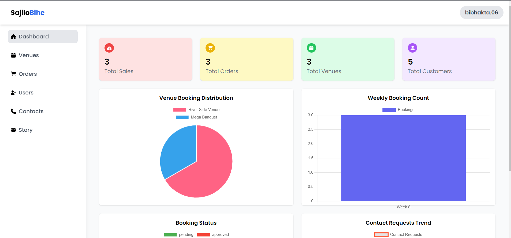

### 🎛️ Responsive Admin Dashboard

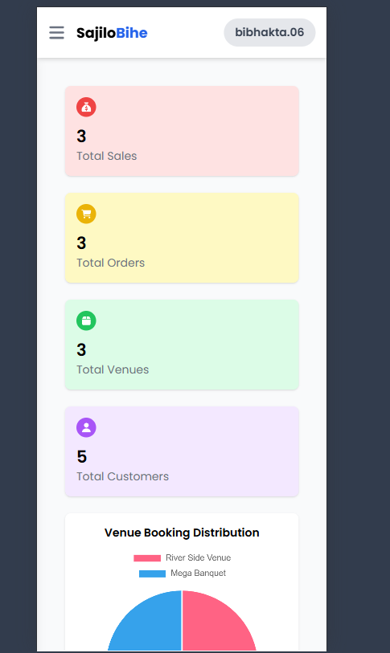

### 🏠 Home Page

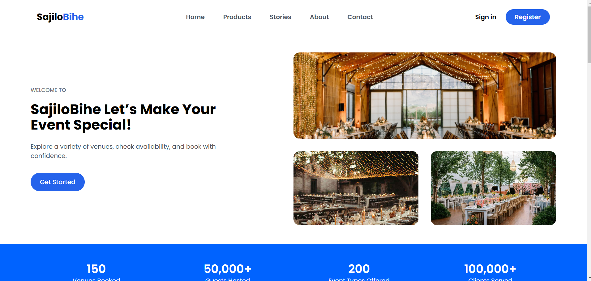

### 🏠 Responsive Home Page

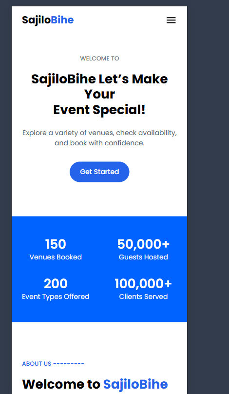

### 🏛️ Venues Listing

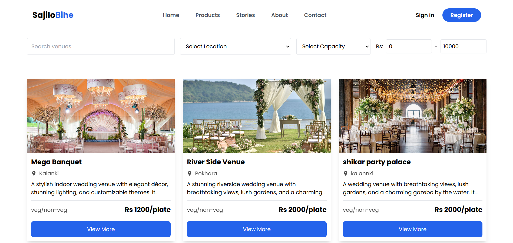

### 📖 Stories Page

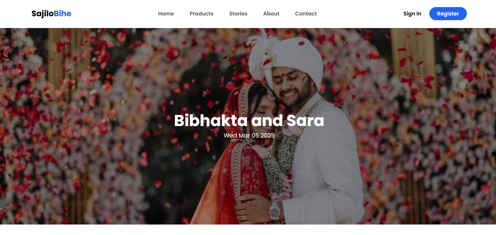

### 🔑 Login Page

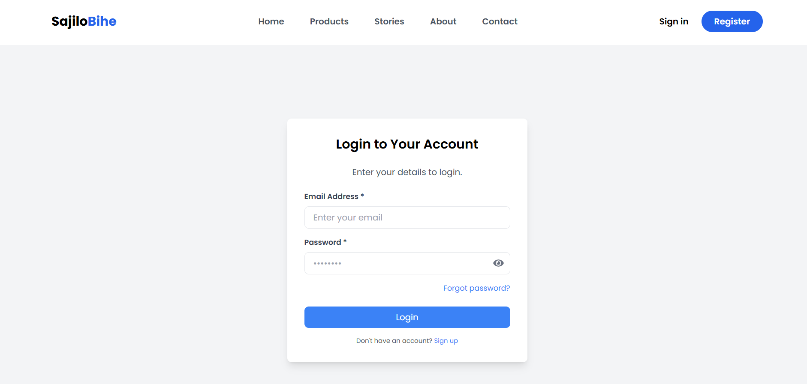

### 📝 Register Page

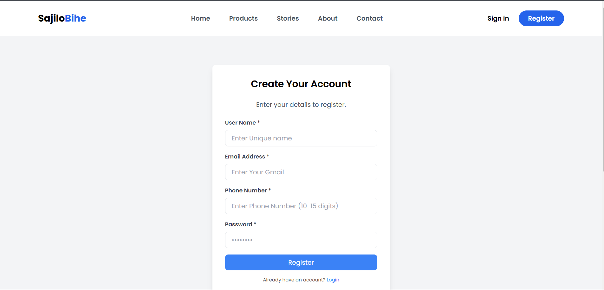

### ➕ Add Venue (Admin)

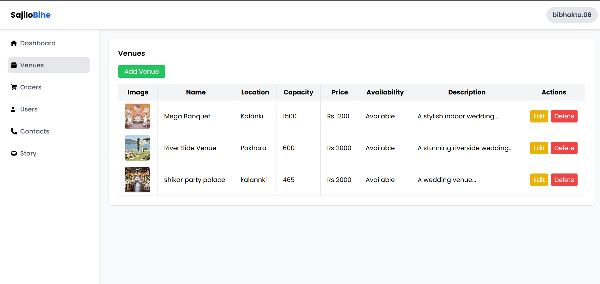

### 📦 Manage Orders (Admin)

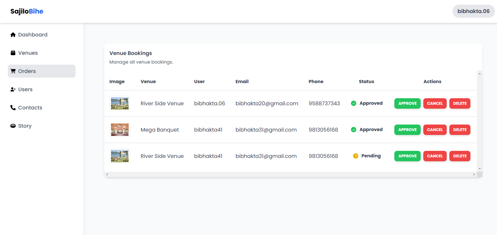

### 👥 Manage Users (Admin)

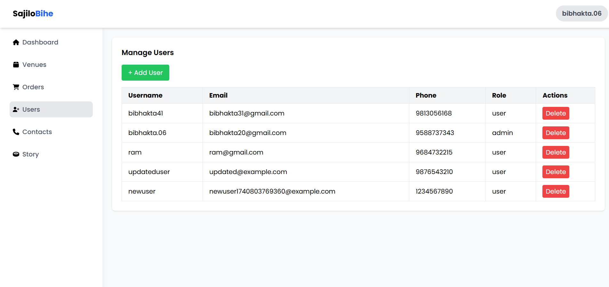

### 📩 Contact Requests (Admin)

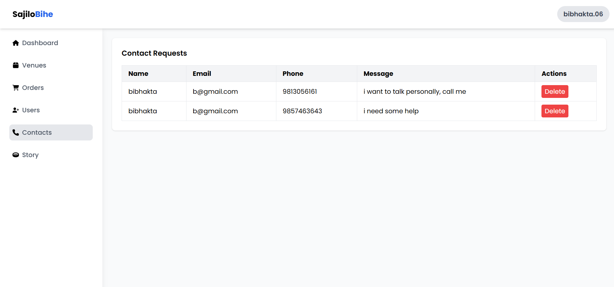

## Contact
For any questions, suggestions, or contributions, please feel free to reach out:

📧 **Email**: [bibhaktalamsal8@gmail.com](mailto:bibhaktalamsal8@gmail.com)  
📺 **YouTube**: [Watch Demo](https://www.youtube.com/watch?v=on68fdI86wM)  
🎨 **Figma**: [View UI Design](https://www.figma.com/design/vG29hg5fuXrRVLyl0dUhUP/SajiloBihe-Web?m=auto&t=ubfUEcRt8ZE8gGZE-1)  
